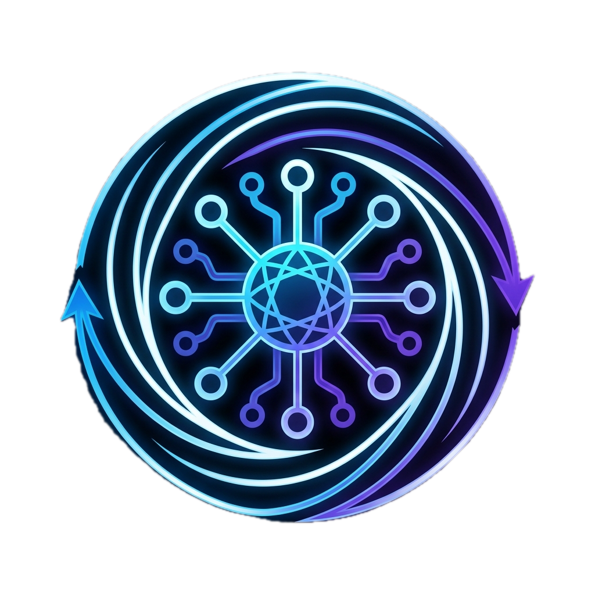

# Syncodalyze AI — Sovereign Governance & Code Intelligence

<p align="center">
  
</p>

**Syncodalyze AI** is a premium, enterprise-grade AI governance and code analysis platform designed for modern engineering oversight. It transforms the standard code review process into a **Sovereign Command Center**, providing total transparent oversight, session-aware resiliency, and deep-trace AI intelligence.

---

## 🏛️ The Governance Node (Admin Nexus)

The core of Syncodalyze AI is the **Governance Node**, designed for high-stakes oversight and administrative accountability.

- **📜 Sovereign Audit Trail**: An immutable ledger recording critical administrative actions (Role management, user status updates) in real-time.
- **🛡️ Refined Administrative Tier**: Precise user designations including the **Sovereign Master** hierarchy and standard **Analyst** nodes.
- **👁️ Review Inspector**: A professional deep-audit portal allows Sovereign Admins to inspect code-level analyses cross-platform with full cryptographic logging.
- **⚙️ Global Configuration Node**: Real-time management of System Intelligence Cores, Token Quotas, and Sector Locks (Maintenance Mode).

---

## 🚀 Sovereign Code Auditor

The analysis workspace provides high-fidelity architectural intelligence with professional developer-centric controls.

- **🧠 Intelligent Persistence**: Session-aware logic that liquidates the draft cache for new reviews while rigorously preserving work during browser refreshes.
- **🧹 Workspace Liquidation**: A dedicated **"Clear"** control node to instantaneously purge the technical environment for fresh analysis.
- **📊 Deep Trace Telemetry**: Comprehensive logging of AI prompts, model responses, and token consumption for total observability.
- **📦 Multi-Vector Input**: Seamless code entry via direct snippet injection or programmatic file orchestration (Upload).

---

## 🧠 Intelligence Core Analysis

Syncodalyze delivers high-density technical analysis across three primary vectors:

1. **Security & Governance**: Identifying critical vulnerabilities and compliance anomalies.
2. **Performance Optimization**: High-trace logic refinement and efficiency scorecards.
3. **Architectural Maintainability**: Scalability analysis and technical debt detection.

---

## 🛠️ Technology Architecture

Built on a specialized, high-performance stack designed for stability and sovereign control.

| Layer | Technologies |
| :--- | :--- |
| **Frontend** | React (Vite-powered), Tailwind CSS, Framer Motion, Lucide-React |
| **Backend** | Node.js, Express.js, Socket.io (Real-Time Telemetry) |
| **Persistence** | MongoDB Atlas (Mongoose ODM) |
| **Intelligence** | Groq AI (Llama 3.3-71b-versatile Intelligence Core) |
| **Communication** | Secure SMTP Integration & WebSockets |

---

## 📦 Sovereign Deployment Guide

### 1. Environment Preparation
Ensure you have **Node.js (v18+)**, a **MongoDB Atlas** instance, and a valid **Groq API key**.

### 2. Configure Your Command Center (`backend/.env`)
```env
# CORE SETTINGS
PORT=5007
MONGODB_URI=your_secure_mongo_uri
JWT_SECRET=your_high_entropy_secret

# AI GOVERNANCE
GROQ_API_KEY=your_groq_api_token
MASTER_ADMIN_EMAIL=your_primary_admin_email

# COMMUNICATION
EMAIL_USER=your_smtp_email
EMAIL_PASS=your_smtp_app_password
FRONTEND_URL=http://localhost:5173
```

### 3. Rapid Launch
```bash
# Initialize Platform
git clone https://github.com/subhajitb7/syncodalyze-ai.git
cd syncodalyze-ai

# Command Backend
cd backend && npm install && npm run dev

# Command Frontend
cd frontend && npm install && npm run dev
```

---

### **Engineering Sovereignty — Developed by SUBHAJIT BAG**
*Built with precision for the next generation of accountable AI intelligence.*
